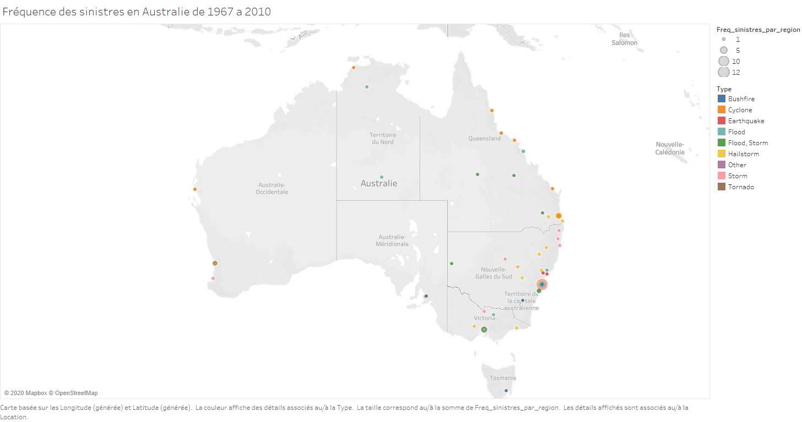

```{r global_options, include=FALSE}
knitr::opts_chunk$set(fig.align = 'center',fig.pos = 'H')
#position par défaut des figures dans le pdf : centrées et à l'endroit où on les construit
library(magrittr) #pour utiliser l'opérateur pipe %>%
options(knitr.table.format = "pandoc") 
```

# Présentation des données et de la problématique

```{r, include=F}
library(CASdatasets)
library(Amelia)
library(ggplot2)
library(car)
data("auscathist")
aus_data = auscathist
```

Notre jeu de données est extrait de la librairie *CASdatasets* de R. Il s'agit de *auscathist* qui recense les catastrophes naturelles en Australie à partir de 1967 selon le type de la catastrophe (tempête, incendie, tremblement de terre...), le trimestre ainsi que la localisation géographique. Il y recense le coût original de chaque catastrophe naturelle, ainsi que les coûts normalisés c'est-à-dire les coûts qui prennent en compte l'inflation ainsi que le salaire moyen minimum. Notre jeu de données est constiué de `r nrow(aus_data)` lignes (les années où des catastrophes naturelles ont eu lieu )  surlesquels on mesure `r ncol(aus_data)` variables. Le tableau \@ref(tab:summaryAusData) résume les caractéristiques initiales de notre jeu de données : 

```{r summaryAusData,echo=F}
knitr::kable(summary(aus_data),align='c',caption="Résumé du jeu de données initial auscathist",booktabs=T)
```

\bigskip

Le tableau \@ref(tab:headAusData) représente un extrait de notre jeu de données : 

\bigskip

```{r headAusData, echo=F}
knitr::kable(head(aus_data),align='c',caption="Un extrait de auscathist",booktabs=T)
```

La problématique de ce projet est donc : Comment modéliser la sévérité et la fréquence des sinistres dus aux catastrophes naturelles en Australie ?

Dans un premier temps, nous nous intéressons à la variable OriginalCost que nous cherchons à expliquer en fonction de la localisation géographique, le trimestre ainsi que le type de catastrophe naturelle à travers deux modèles GLMs(Gamma et gaussien). Dans un second temps, nous essayerons d'expliquer la variable fréquence des catastrophes naturelles que nous rajouterons en fonction des mêmes variables explicatives(localisation, trimestre et type) à travers un modèle GLM Poisson. 

# Exploration et nettoyage des données : 

Bien qu'étant extrait d'une librairie R , notre jeu de données était loin d'être directement exploitable. D'une part, nous avions des données manquantes et des données qui n'étaient pas sous le bon format.

\bigskip

Le tableau \@ref(tab:missingData) recense les données manquantes par classes : 

```{r missingData, echo=F}
knitr::kable(sapply(aus_data,function(x) sum(is.na(x))),align='c',caption="Données manquantes",booktabs=T)
```

Ce qui peut être résumé par ce graphique : 

```{r, echo=F}
missmap(aus_data, main = "Missing values vs observed")
```

Nous supprimons donc la variable LastDay car elle contient un grand nombre de données manquantes, nous supprimons également toutes les lignes qui contiennent des valeurs manquantes. 

```{r, echo=F}
aus_data$LastDay = NULL
n = ncol(aus_data)
for(i in 1:n){
  aus_data = subset(aus_data, !is.na(aus_data[,i]))
}
```

Nous nous retrouvons donc avec un jeu de données de `r nrow(aus_data)` lignes  et `r ncol(aus_data)` colonnes. 

D'autre part et comme le montre cette carte réalisée sous le logiciel Tableau, notre variable Location n'est pas directement exploitable car elle contient `r nrow(aus_data)` classes ce qui représente un grand nombre de classes pour notre GLM.



Par conséquent, nous avons rajouté à la main une variable State qui correspond à l'état où la catastrophe naturelle a été observée. Nous nous retrouvons donc avec 12 classes au lieu de 190. 


```{r, echo=F}
#Pour exécuter le code, j'ai inséré le chemin du fichier sur mon pc, vous pourriez utiliser file.choose() 
aus_data_states = read.csv2("~/3A/cours/Assurance_Non_Vie/Australian_Natural_Catastrophes/data/aus_data_states.csv", sep = ",")
aus_data_states$Quarter = factor(aus_data_states$Quarter)
aus_data_states$OriginalCost = as.numeric(aus_data_states$OriginalCost)
aus_data_states$X = NULL

```

Au final, nous nous retrouvons avec ce jeu de données que nous pouvons directement exploiter cette fois. 

```{r, echo=F}
missmap(aus_data_states, main = "Missing values vs observed")
```

\bigskip
Nos variables explicatives Quarter, State et Type contiennent chacune les classes suivantes :
\bigskip

**Quarter: **

```{r, echo=F}
levels(aus_data_states$Quarter)
```

**State : **

```{r, echo=F}
levels(aus_data_states$State)
```

**Type: ** 

```{r, echo=F}
levels(aus_data_states$Type)
```

\bigskip

# GLMs Gamma et Gaussien

## Répartition du coût des sinistres en fonction des variables explicatives 

Nous souhaitons tout d'abord modéliser la sévérité des sinistres dus aux catastrophes naturelles en Autralie. Pour cela nous voulons expliquer la variable OriginalCost à l'aide de variables explicatives. Afin d'observer le comportement des variables, traçons le coût du sinistre en fonction du trimestre \@ref(fig:costByQuarter), du type de catastrophe \@ref(fig:costByType) et de la localisation géographique \@ref(fig:costByState).

```{r, costByQuarter,fig.cap="Le coût des sinistres par trimestre",echo=FALSE}
ggplot(aus_data_states,aes(x=Quarter,y=OriginalCost))+geom_col()
```

```{r, costByType,fig.cap="Le coût des sinistres par type",echo=FALSE}
ggplot(aus_data_states,aes(x=Type,y=OriginalCost))+geom_col()
```
```{r, costByState,fig.cap="Le coût des sinistres par état",echo=FALSE}
ggplot(aus_data_states,aes(x=State,y=OriginalCost))+geom_col()+theme(axis.text.x=element_text(angle=90))
```

Nous pouvons observer que les trimestres 1 et 4 ont une sévérité de sinistres élevée tandis que le troisième trimestre possède un coût relativement faible. Les tremblements de terre et les tornades se distinguent par un faible coût de sinistre et les états New South Wales et Queensland ont un coût bien plus élévé que les autres états.

\bigskip

## Modélisation du coût des sinistres par un GLM Gamma

On souhaite effectuer un GLM Gamma sur nos données pour étudier la variable OriginalCost en fonction des variables explicatives. Nous supposons ainsi :
$$Y_i | X_i \sim \ \Gamma \ et \ g(E(Y_i|X_i))=\frac{1}{E(Y_i | X_i)} = X_i^{'}\beta$$
où :

  -$Y_i$ correspond au coût du sinistre de la catastrophe i, avec $i =1, …, 183$

  -$(X_{i,j})$ représentent les classes des variables explicatives explicitées plus tôt

```{r, echo=FALSE}
fit_gamma = glm(formula = OriginalCost ~ Quarter + State + Type , data = aus_data_states, family = Gamma())
knitr::kable(anova(fit_gamma, test="Chisq"),align='c',caption="Sortie anova Gamma",booktabs=T)
```

Cette table d'analyse de la déviance est utile pour la sélection de modèles. Les p-values du test du rapport de vraisemblance indiquent que le modèle composé des variables Quarter et State est significatif au seuil de 5%. Néanmoins cette table ne permet pas de vérifier la significativité de chaque variable.

\bigskip

## Choix des variables

Nous allons ainsi tester la significativité de nos variables choisies afin de savoir si elles expliquent le coût des sinistres à l'aide de la fonction Anova du package car .Le tableau \@ref(tab:AnovaGamma) présente les résultats du test :

```{r AnovaGamma, echo=FALSE}
knitr::kable(Anova(fit_gamma, test.statistic = "LR", type=2),align='c',caption="Sortie Anova Gamma pour la significativité",booktabs=T)
```

Le test indique que seule la variable State est significative au seuil de 5%. La variable Quarter est significative au seuil de 10%. La variable Type n'est quand à elle pas significative indiquant que le type de catastrophe naturelle n'a pas d'influence sur le coût du sinistre. Cela semble paradoxal car en regardant le graphique \@ref(fig:costByType) on remarque que les Tremblements de Terre, Tornades et Autres ont un coût de sinistre nettement plus faible que les 6 autres types de catastrophes.

\bigskip

Nous allons donc expliquer le coût des sinistres avec la variable State uniquement.

\bigskip

## Résultats du GLM Gamma

Le GLM Gamma donne les résultats suivants :

```{r, echo=FALSE}
fit_gamma_2 = glm(formula = OriginalCost ~ State , data = aus_data_states, family = Gamma())
summary(fit_gamma_2)
```

La déviance du modèle correspond à la différence entre le modèle étudié et le modèle saturé qui correspond à un modèle plus général ayant autant de paramètres que de variables réponses, et qui a la même distribution et la même fonction de lien que le modèle étudié. La déviance nulle correspond quand à elle à un modèle avec un seul paramètre.

Nous remarquons que la Residual deviance est inférieure à la Null deviance, ce qui veut dire que le modèle enrichi de la variable explicative State est meilleur que le modèle ne contenant que la constante.

L'AIC est un critère de sélection de modèle, ici ce critère vaut 1658.

\bigskip

La déviance de notre modèle est inférieure à `r qchisq(0.95,171) ` qui est le quantile d'une chi-deux à 95% à 171 degrés de liberté. L'ajustement de notre modèle semble donc pertinent.

\bigskip

La majorité des p-values sont supérieures à 0.05, cela veut dire que nos variables ne sont pas significatives par rapport aux classes de références choisies. Par exemple, seule la variable Victoria est significative au seuil 0.1 rapport à la variable New South Wales. En regardant le graphique \@ref(fig:costByState) nous pourrions néanmoins nous attendre à ce que les variables des états North, South East Asia et Tasmania par exemple soient significatives car elles présentent une plus grande disparité par rapport à l'état New South Wales.

\bigskip

## Modélisation du coût des sinistres par un GLM Gaussien

Les résultats obtenus avec le GLM Gamma n'étant pas complètement satisfaisants nous voulons essayer de modéliser le coût des sinistres avec un GLM Gaussien pour comparer les résultats obtenus par les deux modèles et ainsi selectionner le plus pertinent. On suppose alors cette fois :
$$
Y_i|X_i \sim \mathcal{N}ormale
\ et \
g(E(Y_i|X_i))=E(Y_i|X_i)=X_i'\beta
$$
La fonction de lien choisie est l'identité.

```{r, echo=FALSE}
fit_gaussian = glm(formula = OriginalCost ~ Quarter + State + Type, data = aus_data_states, family = gaussian())
knitr::kable(anova(fit_gaussian, test="Chisq"),align='c',caption="Sortie anova Gaussian",booktabs=T)
```

Le test du rapport de vraisemblance indique que le modèle composé des variables Quarter et State est significatif au seuil de 5%.

\bigskip

## Choix des variables

Nous allons ainsi tester la significativité de nos variables choisies afin de savoir si elles expliquent le coût des sinistres à l'aide de la fonction Anova du package car .Le tableau \@ref(tab:AnovaGaussian) présente les résultats du test :

```{r AnovaGaussian, echo=FALSE}
knitr::kable(Anova(fit_gaussian, test.statistic = "LR", type=2),align='c',caption="Sortie Anova Gaussien pour la significativité",booktabs=T)
```

Le test indique que les variables Quarter et State sont significatives au seuil de 5%. On constate que pour ce modèle également la variable Type n'a pas d'influence sur le coût du sinistre engendré par la catastrophe naturelle, ce qui semble paradoxal.

\bigskip

Nous allons ainsi expliquer le coût des sinistres par un GLM Gaussian ayant les variables Quarter et State comme variables explicatives.

\bigskip

## Résultats du GLM Gaussien

La modélisation donne le résultat suivant :

```{r, echo=FALSE}
fit_gaussian_2 = glm(formula = OriginalCost ~ Quarter + State , data = aus_data_states, family = gaussian())
summary(fit_gaussian_2)
```

La Residual deviance est inférieure à la Null deviance, ce qui veut dire que le modèle enrichi des variables explicatives Quarter et State est meilleur que le modèle ne contenant que la constante, le modèle expliqué a donc un pouvoir explicatif.

L'AIC est un critère de sélection de modèle, ici ce critère vaut 1669.8.

\bigskip

La déviance résiduelle de notre modèle est largement supérieur à `r qchisq(0.95,168) ` qui est le quantile d'une chi-deux à 95% à 168 degrés de liberté. Cela signifie que l'ajustement de notre modèle n'est pas pertinent.

\bigskip

La majorité des p-values sont supérieures à 0.05, seulement 4 classes ont une p-values inférieure au seuil de 5%. Cela veut dire que nos variables ne sont pas significatives par rapport aux classes de références choisies.

\bigskip

Ces différentes observations nous indiquent que la modélisation du GLM Gaussien de fonction de lien identité pour expliquer le coût des sinistres en fonction du trimestre et de l'Etat n'est pas pertinente et que nous devons rejeter ce modèle. De plus, l'AIC du GLM Gaussian est supérieur à l'AIC du GLM Gamma (1669.8>1658), indiquant que le modèle Gamma est plus pertinant que le modèle Gaussien.

\bigskip

# GLM Poisson 

Nous supposons dans cette partie que

$$Y_i | X_i \sim \ \mathcal{P} \ et \ g(E(Y_i|X_i))=\log({E(Y_i | X_i))} = X_i^{'}\beta$$
où :

  -$Y_i$ correspond à la fréquence du sinistre de la catastrophe i, avec $i =1, …, 183$

  -$(X_{i,j})$ représentent les classes des variables explicatives explicitées plus tôt

## Répartition de la fréquence en fonction des variables explicatives 

Notre jeu de données ne contient pas de variable *fréquence des catastrophes naturelles*. Par conséquent, nous la fabriquons nous-mêmes en comptant le nombre de sinistres par année. 

```{r, echo=F}
frequence = aggregate(aus_data_states$Type, by = aus_data_states["Year"], FUN = length)
colnames(frequence) = c("Year","Frequence per year")
aus_data = merge(aus_data_states, frequence )
```

Les graphiques \@ref(fig:freqByQuarter) , \@ref(fig:freqByType) ainsi que \@ref(fig:freqByState) nous montrent comment se répartit la fréquence des sinistres en fonction des variables explicatives que nous avons choisies.

```{r freqByQuarter,fig.cap="La fréquence des sinistres par trimestre", echo=F}
ggplot(aus_data,aes(x=Quarter,y=`Frequence per year`))+geom_col()
```


```{r freqByType, fig.cap="La fréquence des sinistres par type", echo=F}
ggplot(aus_data,aes(x=Type,y=`Frequence per year`))+geom_col()
```


```{r freqByState, fig.cap="La fréquence des sinistres par état", echo=F}
ggplot(aus_data,aes(x=State,y=`Frequence per year`))+geom_col()+theme(axis.text.x=element_text(angle=90))
```

Nous remarquons alors que les premiers et derniers trimestres de l'année concentrent le plus de catastrophes naturelles, que les tempêtes sont les catastrophes naturelles les plus fréquentes et que l'état de New South Wales accumule le plus de catastrophes naturelles en Australie de 1967 à 2010. Ces observations vont influencer le choix de nos classes de références dans le paragraphe \@ref(choixVariables).

\bigskip

## Choix des variables {#choixVariables}


Nous désirons d'abord tester la significativité de nos variables choisies afin de savoir si elles expliquent la fréquence des sinistres. Le tableau \@ref(tab:AnovaPoisson) présente les résultats du test d'analyse de variance (Anova du package car) : 

```{r AnovaPoisson, echo=F}
fit_poisson = glm(formula = aus_data$`Frequence per year` ~ Quarter + State + Type , data = aus_data, family = poisson )
knitr::kable(Anova(fit_poisson,test.statistic = "LR", type = 2),align='c',caption="Sortie Anova poisson",booktabs=T)
```

Ce test nous montre que la variable State n'est pas significative car sa p-value est supérieure à 5%. Cela veut dire que la localisation géographique des catastrophes naturelles présentes dans notre jeu de données n'influe pas sur leur fréquence. Ce résultat est surprenant car le graphique \@ref(fig:freqByState) montre que l'état de New South Wales concentre une grande partie des catastrophes naturelles, nous pourrions donc penser qu'il y a plus de chances qu'une catastrophe naturelle ait lieu à New South Wales qu'autre part en Australie mais visiblement ce n'est pas le cas pour ce modèle GLM Poisson à trois variables.

\bigskip

Nous allons donc garder les variables explicatives Quarter et Type et essayer d'expliquer la fréquence des sinistres à partir d'un GLM Poisson. 

Les tracés \@ref(fig:freqByQuarter) , \@ref(fig:freqByType) montrent qu'on observe le plus grand nombre des sinistres au premier et dernier trimestre de l'année et que les tempêtes sont les catastrophes naturelles les plus fréquentes en Australie.

\bigskip

Du fait que dans la sortie glm de R, les coefficients calculés le sont par rapport à une classe de référence, nous choisissons les classes pour lesquelles on observe les plus petites fréquences afin de repérer facilement les variables significatives dans la sortie R. Nous choisissons donc ces classes de références : le troisième trimestre pour Quarter et Tornado pour Type.

```{r, echo=F}
aus_data$Type <- relevel(aus_data$Type, ref = "Tornado")
aus_data$Quarter <- relevel(aus_data$Quarter, ref = "3")
```


## Résultats du GLM Poisson

Notre GLM Poisson nous donne les résultats suivants : 

```{r, echo=F}
fit_poisson_2 = glm(formula = aus_data$`Frequence per year` ~ Quarter + Type , data = aus_data, family = poisson )
summary(fit_poisson_2)
```


Nous remarquons que la Residual deviance est inférieure à la Null deviance, ce qui veut dire que le modèle enrichi de nos deux variables explicatives est meilleur que le modèle qui ne contient que la constante. 

\bigskip

La déviance de notre modèle est supérieure à `r qchisq(0.95,171) ` qui est le quantile d'une chi-deux à 95% à 171 degrés de liberté. Notre modèle n'est pas bien ajusté.

\bigskip
Plusieurs de nos p-values sont supérieures à 0.05, cela veut dire que nos variables ne sont pas significatives par rapport aux classes de références choisies. Par exemple, seule la variable Quarter2 est significative au seuil 0.1 rapport à la variable Quarter3, ce qui est surprenant car le graphique \@ref(fig:freqByQuarter) montre qu'il y a un grand écart entre les trimestres 3 et 1. Nous remarquons également que les variables BushFire, Cyclone, Earthquake et Flood sont celles qui représentent le plus d'écart par rapport à Tornado. Nous nous attendions à ce que la variable Storm soit significative car son écart avec Tornado est important d'après \@ref(fig:freqByQuarter). Seule la variable Earthquake est donc significative par rapport à Tornado même si l'écart entre les deux n'est pas très important. 


